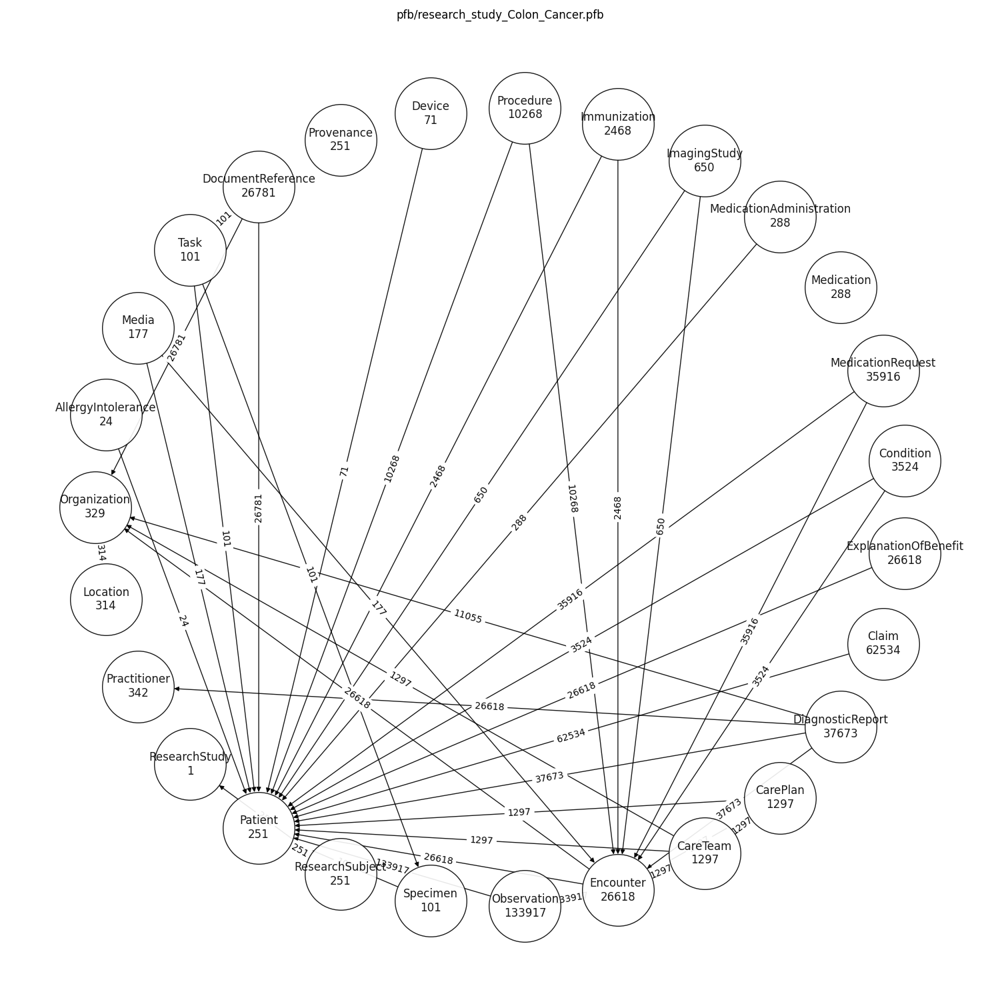

# Expected Results 

* PFB Files

```commandline
$ ls -lh pfb/

total 6004216
-rw-r--r--  1 walsbr  OHSUM01\Domain Users   149M Aug 17 18:55 research_study_Alcoholism.pfb
-rw-r--r--  1 walsbr  OHSUM01\Domain Users   621M Aug 17 18:32 research_study_Alzheimers.pfb
-rw-r--r--  1 walsbr  OHSUM01\Domain Users    81M Aug 17 19:13 research_study_Breast_Cancer.pfb
-rw-r--r--  1 walsbr  OHSUM01\Domain Users   362M Aug 17 19:11 research_study_Colon_Cancer.pfb
-rw-r--r--  1 walsbr  OHSUM01\Domain Users   1.0G Aug 17 18:49 research_study_Diabetes.pfb
-rw-r--r--  1 walsbr  OHSUM01\Domain Users   112M Aug 17 18:52 research_study_Lung_Cancer.pfb
-rw-r--r--  1 walsbr  OHSUM01\Domain Users   539M Aug 17 19:04 research_study_Prostrate_Cancer.pfb

```

## research_study_Alcoholism


## research_study_Alzheimers


## research_study_Breast_Cancer


## research_study_Colon_Cancer



## research_study_Diabetes


## research_study_Lung_Cancer


## research_study_Prostrate_Cancer


